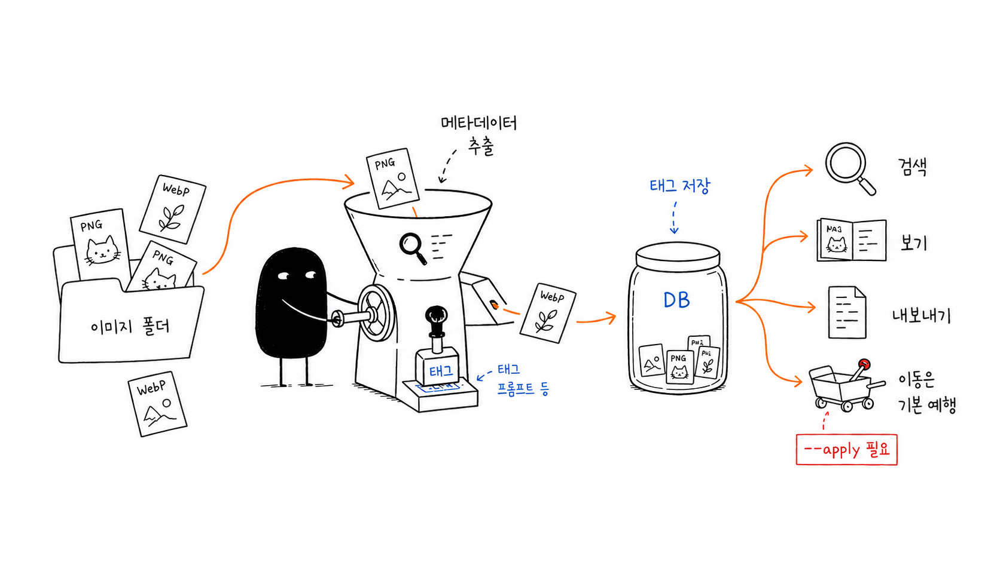

# imv

`imv`는 NovelAI와 ComfyUI 이미지의 메타데이터를 로컬에서 색인·검색·내보내기·정리하는 CLI 우선 도구입니다. 설치 부담이 낮은 Go CLI가 중심이며, 같은 공통 코어를 사용하는 밝고 따뜻한 Wails 데스크톱 GUI를 함께 제공합니다.

`imv` is a CLI-first local tool for indexing, searching, exporting, and organizing NovelAI and ComfyUI image metadata. The low-friction Go CLI is the primary interface, with a bright, warm Wails desktop GUI built on the same shared core.



`이미지 열기 → 메타데이터 읽기 → 태그 검색 → 이동 계획 검토 → 확인 후 이동`

## 다운로드 / Download

Windows 사용자는 [GitHub Releases](https://github.com/soira237-risu/ai-image-metadata-organizer/releases/latest)에서 최신 `imv-vX.Y.Z-windows-amd64.zip`을 받을 수 있습니다. ZIP에는 자동화용 `imv.exe`와 선택형 데스크톱 앱 `imv-gui.exe`가 함께 들어갑니다.

Windows users can download the latest `imv-vX.Y.Z-windows-amd64.zip` from [GitHub Releases](https://github.com/soira237-risu/ai-image-metadata-organizer/releases/latest). The archive contains the `imv.exe` CLI and the optional `imv-gui.exe` desktop app.

> 실행 파일은 아직 코드 서명되지 않아 Windows SmartScreen 경고가 표시될 수 있습니다. / The executables are not code-signed yet, so Windows SmartScreen may display a warning.

## 주요 기능 / Features

- PNG 및 WebP 폴더 스캔과 SQLite 로컬 색인 / Scan PNG and WebP folders into a local SQLite index
- NovelAI prompt, negative prompt, 설정값과 태그 추출 / Extract NovelAI prompts, negative prompts, settings, and tags
- ComfyUI workflow 요약과 일반 이미지 메타데이터 확인 / Summarize ComfyUI workflows and inspect generic image metadata
- 태그·텍스트·출처·형식 검색, 태그 요약과 통계 / Search by tags, text, source, and format; summarize tags and statistics
- 결정적 JSON 내보내기 / Deterministic JSON export
- dry-run 우선 파일 정리와 충돌 처리 / Dry-run-first file organization with conflict handling
- 같은 `internal/appcore`를 사용하는 CLI와 독립 데스크톱 GUI / CLI and standalone desktop GUI sharing `internal/appcore`

## 빠른 시작 / Quick start

소스에서 빌드하려면 Windows PowerShell과 Go 1.22 이상이 필요합니다.

Building from source requires Windows PowerShell and Go 1.22 or newer.

```powershell
git clone https://github.com/soira237-risu/ai-image-metadata-organizer.git
Set-Location .\ai-image-metadata-organizer

go build -o .\bin\imv.exe .\cmd\imv
.\bin\imv.exe scan "C:\Path\To\AI-Images" --db .\.imv\imv.db
.\bin\imv.exe search --tag "blue hair" --db .\.imv\imv.db
```

## CLI 명령 / CLI commands

```text
imv scan <folder> [--db .imv/imv.db] [--workers 4] [--rescan] [--fail-on-error] [--json]
imv show <path-or-id> [--raw] [--json]
imv search [--tag <tag>] [--source nai|comfyui] [--format png|webp] [--has-workflow] [--q <text>] [--limit 50] [--long] [--json]
imv tags [--source nai|comfyui|generic|unknown] [--q <text>] [--limit 100] [--json]
imv stats [--json]
imv export --out <file.json> [--pretty]
imv move --tag <tag> --to <folder> [--apply] [--conflict skip|rename]
```

명령별 옵션은 `imv help <command>`로 확인할 수 있습니다. `scan`은 파일별 오류를 기록하면서 나머지 파일을 계속 처리합니다. 자동화에서 하나의 파일 오류도 실패로 취급하려면 `--fail-on-error`를 사용하세요.

Use `imv help <command>` for command-specific options. `scan` records per-file errors and continues with remaining files; use `--fail-on-error` when automation should fail on any file error.

## 안전한 파일 이동 / Safe file moves

`move`는 기본적으로 계획만 출력합니다. 원본과 대상 경로를 확인한 뒤에만 `--apply`를 추가하세요. GUI도 계획을 검토하고 앱 내부 확인을 거친 경우에만 이동을 실행합니다.

`move` prints a plan by default. Add `--apply` only after reviewing source and destination paths. The GUI also requires plan review and in-app confirmation before applying a move.

```powershell
.\bin\imv.exe move --tag "1girl" --to "C:\Path\To\Organized" --db .\.imv\imv.db
.\bin\imv.exe move --tag "1girl" --to "C:\Path\To\Organized" --conflict rename --apply --db .\.imv\imv.db
```

## 데스크톱 GUI / Desktop GUI

GUI는 폴더 선택, 스캔과 취소, 검색·태그·통계, 이미지 상세, JSON 내보내기, 이동 계획 검토를 제공합니다. 프런트엔드를 변경했다면 임베드 자산을 다시 만든 뒤 GUI를 빌드합니다.

The GUI provides folder selection, cancellable scans, search, tags, statistics, image details, JSON export, and move-plan review. Rebuild embedded frontend assets before building the GUI after frontend changes.

```powershell
Set-Location .\gui
npm ci
npm run typecheck
npm run test:run
npm run build
Set-Location ..

go build -tags native_webview2loader -ldflags "-H=windowsgui" -o .\bin\imv-gui.exe .\cmd\imv-gui
```

## 개발과 구조 / Development and architecture

- [`AGENTS.md`](AGENTS.md): 작업 규칙과 불변조건 / working rules and invariants
- [`docs/ARCHITECTURE.md`](docs/ARCHITECTURE.md): 코드 경계와 데이터 흐름 / code boundaries and data flow
- [`docs/DEVELOPMENT.md`](docs/DEVELOPMENT.md): 개발·검증 절차 / development and verification
- [`docs/ROADMAP.md`](docs/ROADMAP.md): 우선순위와 비목표 / priorities and non-goals
- [`docs/GUI_DESIGN.md`](docs/GUI_DESIGN.md): GUI 상태·시각 계약 / GUI state and visual contract
- [`docs/RELEASING.md`](docs/RELEASING.md): 실행 파일 릴리스 절차 / executable release process
- [`docs/decisions/`](docs/decisions): 장기 기술 결정 / durable technical decisions

기본 검증 / Default verification:

```powershell
go test ./...
go vet ./...
go build -o .\bin\imv.exe .\cmd\imv
.\bin\imv.exe help
```

## 기여와 보안 / Contributing and security

[CONTRIBUTING.md](CONTRIBUTING.md)에서 기여 방법을, [SECURITY.md](SECURITY.md)에서 비공개 보안 신고 방법을 확인하세요.

See [CONTRIBUTING.md](CONTRIBUTING.md) for contribution guidance and [SECURITY.md](SECURITY.md) for private vulnerability reporting.

MIT License.
