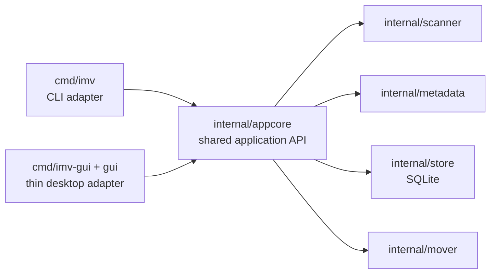

# 아키텍처 / Architecture

## 결정 요약 / Decision summary

`imv`는 CLI 우선 제품이다. 스캔·검색·조회·태그 집계·통계·내보내기·이동은 공통 Go 코어에서 구현하고, CLI와 GUI는 그 코어를 호출하는 어댑터로 취급한다.

`imv` is a CLI-first product. Scanning, search, inspection, tag summaries, statistics, export, and moves live in the shared Go core; CLI and GUI are adapters over that core.

## 구성요소 / Components

### `cmd/imv`

- 하위 명령과 플래그 해석
- 사용자 입력 검증
- 사람이 읽는 표·요약 및 안정적인 JSON 출력
- 비즈니스 규칙을 직접 구현하지 않음

### `internal/appcore`

- CLI와 GUI가 공유하는 애플리케이션 API
- 요청·응답 타입과 기본값 정의
- 스캐너, 저장소, 이동기를 조합
- 새로운 사용자 기능의 기본 진입점

### `internal/metadata`

- PNG/WebP 컨테이너 파싱
- NovelAI, ComfyUI, generic 메타데이터 정규화
- 검색 가능한 prompt, tag, setting, workflow 요약 생성

### `internal/scanner`

- 이미지 재귀 탐색과 병렬 추출
- 크기와 수정 시각을 이용한 unchanged skip
- 추출 결과를 SQLite에 upsert

### `internal/store`

- `.imv/imv.db` SQLite 스키마와 조회
- CGO가 필요 없는 `modernc.org/sqlite` 사용
- 버전 마이그레이션, foreign key, busy timeout 설정
- 검색·내보내기는 ID 목록을 일괄 hydration하여 N+1 상세 조회를 피함

### `internal/mover`

- 태그 기반 이동 계획
- dry-run 기본값과 충돌 처리
- 다른 볼륨은 임시 파일 copy·sync·rename·원본 삭제로 안전하게 처리
- 적용 중 DB 갱신 실패 시 파일 이동 rollback

### `cmd/imv-gui`와 `gui`

- Wails 창, 파일 선택 대화상자, 스캔 취소, 진행 이벤트, React 화면
- `appcore` 메서드를 얇게 노출
- React 컨트롤러 훅이 비동기 요청 순서와 화면 상태만 관리
- 표시 컴포넌트는 툴바·필터·결과·상세·이동·상태 바로 분리
- GUI 전용 비즈니스 규칙이나 별도 데이터베이스 계층을 추가하지 않음

## 데이터 흐름 / Data flow

1. `scan`이 PNG/WebP 경로를 발견한다.
2. `metadata`가 컨테이너와 생성기별 메타데이터를 추출한다.
3. `store`가 파일·메타데이터·태그를 SQLite에 기록한다.
4. `search`, `show`, `tags`, `stats`, `export`가 같은 인덱스를 읽는다.
5. `move`는 먼저 계획을 보여주고 `--apply`가 있을 때만 파일과 DB 경로를 변경한다.

## GUI 전략 / GUI strategy

- CLI 기능을 먼저 완성하고 테스트한다.
- GUI는 CLI 문자열 출력을 파싱하지 않고 `appcore`를 직접 호출한다.
- 하나의 Windows 실행 파일에 CLI와 Wails를 억지로 합치는 것은 목표가 아니다.
- 배포가 필요할 때는 두 실행 파일을 한 패키지로 묶고 단일 빌드 명령을 제공한다.
- GUI를 다시 확장할 때도 독립 데스크톱 창을 유지하며 브라우저 UI는 기본 경로로 삼지 않는다.
- GUI의 검색·상세·이동 계획 요청은 가장 최근 요청만 반영하고 Wails 이벤트 구독은 unmount 때 해제한다.
- 파일 이동 적용은 공통 코어의 dry-run 결과와 정확히 같은 요청 스냅샷만 허용한다.

## 보존해야 할 안전성 / Safety properties

- `move`는 dry-run이 기본이다.
- 실제 파일 쓰기는 명시적 사용자 요청 뒤에만 수행한다.
- JSON 출력은 자동화가 의존할 수 있는 계약으로 취급한다.
- 메타데이터 파싱 실패는 가능한 한 파일별 오류로 격리한다.
- 데이터베이스 스키마 변경은 마이그레이션과 rollback 계획을 동반해야 한다.
- export는 같은 디렉터리의 임시 파일을 sync한 뒤 원자적으로 교체한다.
