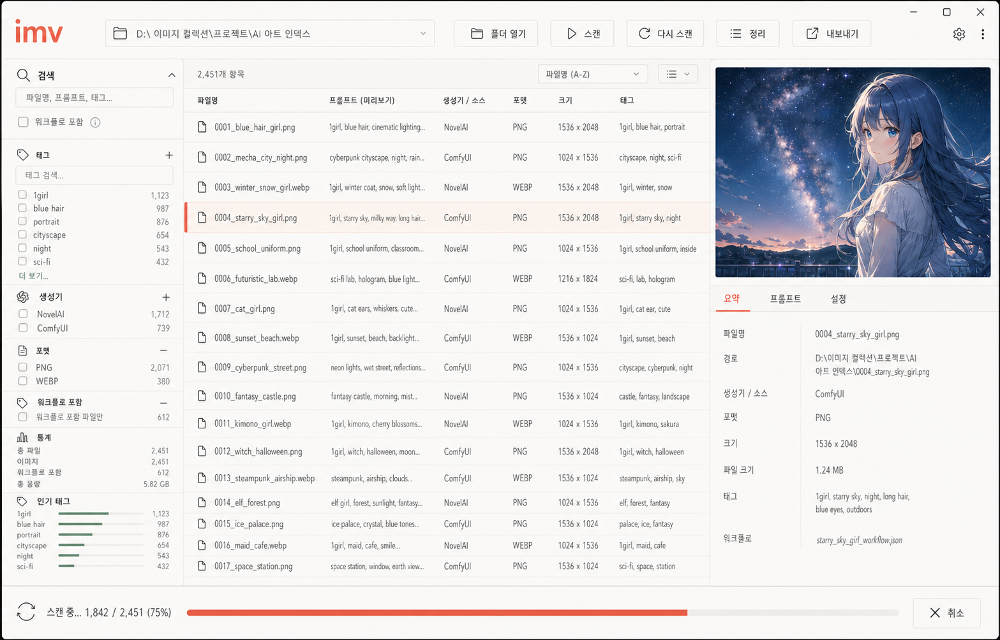

# GUI 디자인과 상태 계약 / GUI design and state contract

## 목적 / Purpose

GUI는 CLI를 대체하거나 비즈니스 규칙을 복제하지 않는다. 공통 `internal/appcore` 기능을 파일 탐색과 시각 검토에 맞게 연결하는 얇은 Wails 데스크톱 화면이다.

The GUI does not replace the CLI or duplicate business rules. It is a thin Wails desktop surface that connects shared `internal/appcore` capabilities to folder browsing and visual review.

## 기준 콘셉트 / Reference concept

- 기본 캔버스: warm ivory `#FAF7F2`
- 표면: `#FFFDF9` / `#FFFFFF`
- 본문: dark cocoa `#2B2622`
- 주요 동작: coral `#E6785B`
- 보조 상태: sage `#7C9A82`
- 선택 행: pale peach `#FCE8DF`
- 그라데이션, 유리 효과, 어두운 테마, 카드 과잉 사용은 피한다.

## 화면 구조 / Layout

- 상단: 브랜드, 전역 검색, 폴더·스캔·재스캔·내보내기
- 왼쪽: 생성 도구, 파일 형식, 워크플로, 통계, 인기 태그
- 가운데: 밀도 높은 이미지 목록
- 오른쪽: 미리보기, 파일 정보, 태그, 생성기별 메타데이터
- 아래: dry-run 이동 계획과 상태·진행률
- 기준 크기 1280×820, 최소 크기 960×640

## 상태 불변조건 / State invariants

1. 검색, 상세 조회, 이동 계획은 최신 요청의 응답만 반영한다.
2. 폴더가 바뀌면 이전 레코드, 상세, 태그, 통계, 이동 계획을 즉시 비운다.
3. Wails 이벤트 구독은 컴포넌트가 해제될 때 함께 해제한다.
4. 이동 계획은 `{tag, to, conflict}` 요청 스냅샷과 묶는다.
5. 계획 뒤 입력이 바뀌면 적용을 막고 다시 계획하도록 안내한다.
6. 실제 이동은 앱 내부 확인 대화상자에서만 시작한다.
7. GUI는 스캔·검색·이동 규칙을 구현하지 않고 백엔드의 공통 코어를 호출한다.
8. 스캔과 파일 이동은 동시에 실행하지 않으며, 실제 이동 중에는 폴더 전환과 export를 잠근다.

## 코드 경계 / Code boundaries

- `hooks/useLibraryController.ts`: 비동기 수명주기와 화면 상태
- `components/`: 표시와 사용자 입력
- `api.ts`: Wails 메서드 이름을 감싼 얇은 호출 계층
- `cmd/imv-gui/backend.go`: 대화상자, 이벤트, context와 `appcore` 연결
